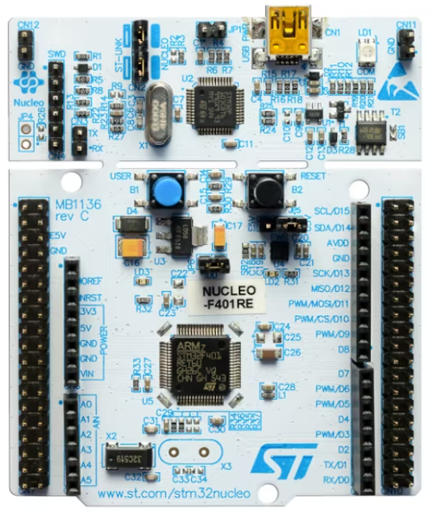
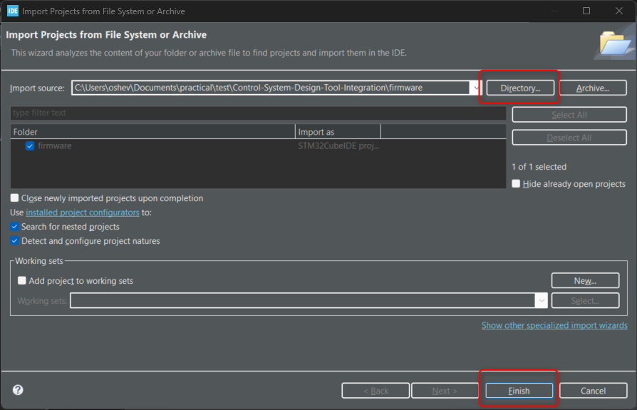
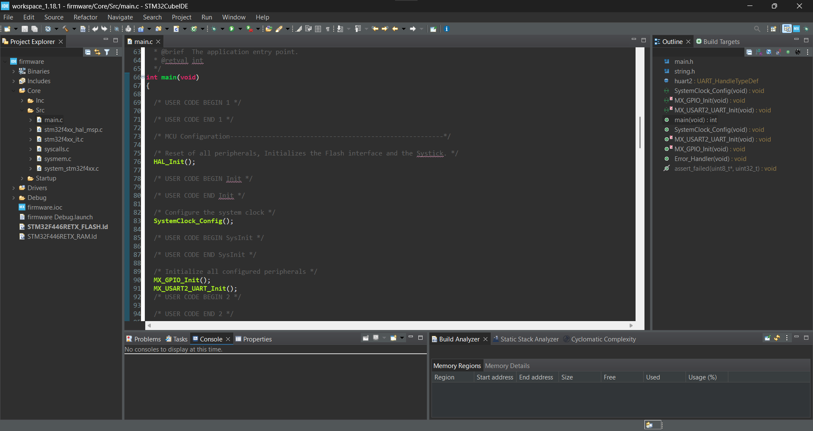
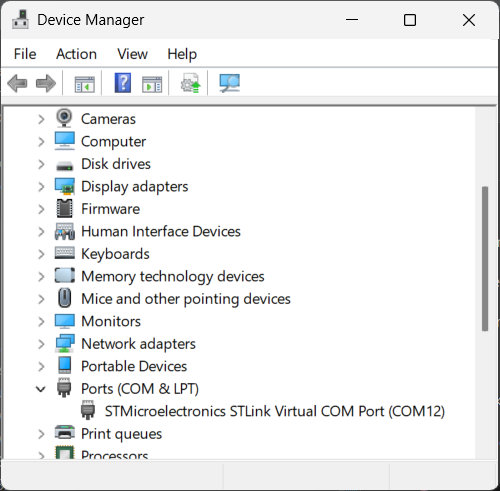
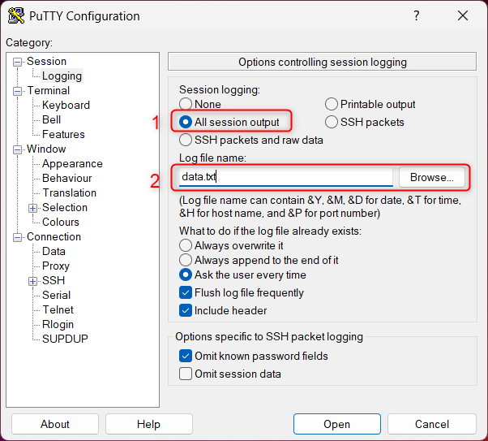
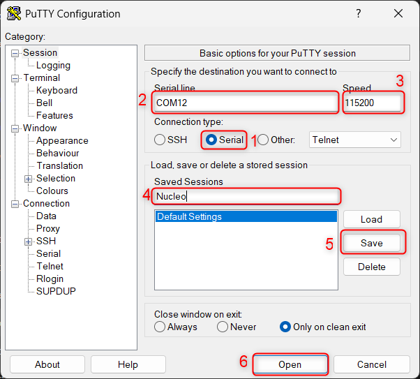
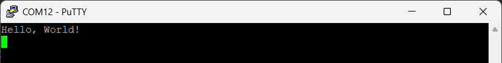
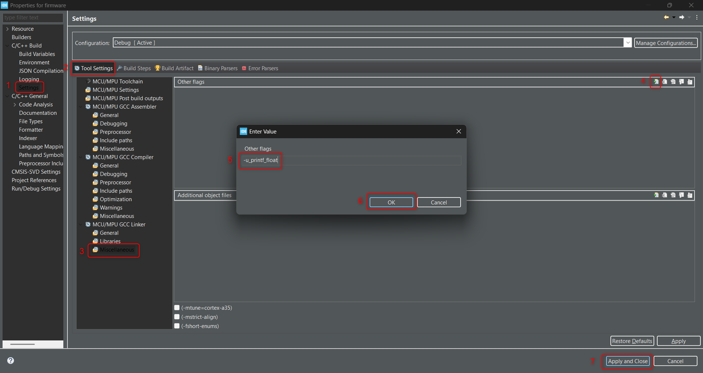
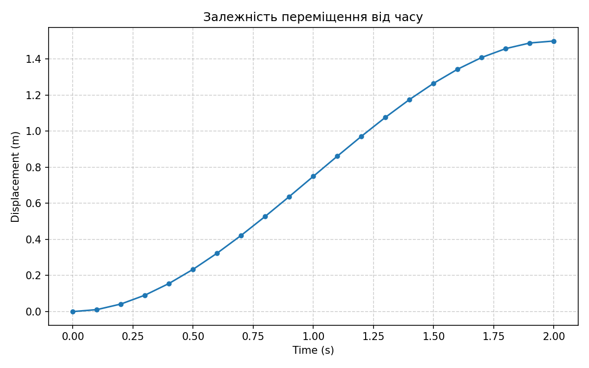

## Практична 1: Інтеграція засобів розробки систем керування

---

**Мета практичної роботи**
Ознайомитися з інтеграцією засобів розробки систем керування шляхом:
⦁	встановлення необхідного програмного забезпечення (ПЗ)
⦁	клонування та збірки проєкту з віддаленого репозиторію
⦁	завантаження програми до мікроконтролера
⦁	створення механізму запису цифрових даних у файл
⦁	побудови графіка функції переміщення у Python на основі зібраних даних та обчислення інших кінематичних залежностей

---

### 1 Підготовка робочого середовища
#### 1.1 Необхідне програмне забезпечення
Перед початком роботи переконайтесь, що встановлено наступне ПЗ та створені необхідні облікові записи:

| Програма               | Опис                                               | Посилання                     |
|------------------------|----------------------------------------------------|----------------------------------------------------|
| **STM32CubeIDE**       | Інтегроване середовище для розробки під STM32      | [Офіційна сторінка](https://www.st.com/en/development-tools/stm32cubeide.html) |
| **STM32CubeMX**        | Графічний засіб конфігурації STM32 та генерації коду ініціалізації |[Офіційна сторінка](https://www.st.com/en/development-tools/stm32cubemx.html) |
| **PuTTY**              | Термінальний клієнт із підтримкою послідовного порту (Serial)       | [Офіційна сторінка](https://www.chiark.greenend.org.uk/~sgtatham/putty/latest.html)               |
| **Python**             | Мова програмування, використовується в курсі для обробки та аналізу даних | [Офіційна сторінка](https://www.python.org/downloads/) |


> У курсі використовуються
 STM32CubeIDE Version: 2.2.0 
 STM32CubeMX Version: 6.18.1

##### 1.1.1 Встановлення STM32CubeIDE
- Перейдіть на офіційний сайт STM:
   [https://www.st.com/en/development-tools/stm32cubeide.html](https://www.st.com/en/development-tools/stm32cubeide.html).

- Зареєструйтеся або увійдіть у свій обліковий запис ST.com, щоб отримати доступ до завантаження інсталятора.

- Завантажте інсталятор відповідно до вашої операційної системи (Windows / macOS / Linux).

- Запустіть інсталятор та дотримуйтесь інструкцій майстра встановлення.

- Після завершення встановлення відкрийте STM32CubeIDE.

> У Windows може знадобитись перезавантаження після інсталяції.

##### 1.1.2 Встановлення STM32CubeMX
- Перейдіть на офіційний сайт STM:
   [https://www.st.com/en/development-tools/stm32cubemx.html](https://www.st.com/en/development-tools/stm32cubemx.html).

- Увійдіть у свій обліковий запис ST.com (той самий, що для завантаження STM32CubeIDE).

- Завантажте інсталятор **STM32CubeMX** для вашої операційної системи (Windows / macOS / Linux).

- Запустіть інсталятор та дотримуйтесь інструкцій майстра встановлення.

- Після першого запуску STM32CubeMX дочекайтесь завантаження необхідних пакетів прошивки (**STM32Cube FW_F4**).

- Переконайтесь, що встановлена версія **6.18.1** (`Help` → `About STM32CubeMX`).

> STM32CubeMX підтримує роботу з файлами конфігурації .ioc

##### 1.1.3 Встановлення драйверів
Після встановлення STM32CubeIDE переконайтеся, що драйвери для програматора ST-Link встановлені:

- Підключіть плату Nucleo до комп'ютера через USB.
- Якщо пристрій не розпізнано — встановіть драйвер вручну:
   - Завантажте **ST-LINK USB driver** з офіційного сайту:
     [https://www.st.com/en/development-tools/st-link-v2.html](https://www.st.com/en/development-tools/st-link-v2.html)
   - Встановіть драйвер та перезавантажте комп’ютер (якщо буде потрібно).
- Перевірте, чи плата визначається у STM32CubeIDE — натисніть `Run` або `Debug`.

> У Windows драйвер часто встановлюється автоматично під час інсталяції STM32CubeIDE, але не завжди.

#### 1.2 Необхідне апаратне забезпечення
Плата розробки [**NUCLEO-F446RE**](https://www.st.com/en/evaluation-tools/nucleo-f446re.html) та USB кабель.



### 2 Робота з репозиторієм та середовищем розробки
Перед початком переконайтесь, що:
- У вас є обліковий запис на [https://github.com](https://github.com), створений за допомогою університетської електронної пошти.
- Встановлено Git: [https://git-scm.com/downloads](https://git-scm.com/downloads).
- Ви маєте доступ до завдання на [Classroom 50](https://classroom50.org/). Посилання на assignment надає викладач.

#### 2.1 Налаштування Git (вперше)
У терміналі або Git Bash введіть:

```bash
git config --global user.name "FirstName LastName"
git config --global user.email "your_email@ucu.edu.ua"
```

> Замість `your_email@ucu.edu.ua` вкажіть власну університетську пошту.

#### 2.2 Отримання репозиторію через Classroom 50
1. Відкрийте **посилання на assignment**, яке надав викладач.
2. Увійдіть у [Classroom 50](https://classroom50.org/) через свій обліковий запис GitHub.
3. Прийміть завдання (**Accept**). Classroom 50 створить для вас **приватний GitHub-репозиторій** на основі шаблону практичної.
4. Відкрийте створений репозиторій на GitHub і скопіюйте **Clone URL** (кнопка `Code` → HTTPS або SSH).

> Не клонуйте шаблонний репозиторій курсу напряму. Працюйте лише з репозиторієм, створеним після Accept у Classroom 50 — саме туди здаватимете роботу.

#### 2.3 Клонування та робота з Git
Склонуйте свій assignment-репозиторій:

```bash
git clone <Clone URL з вашого репозиторію Classroom 50>
cd <назва-репозиторію>
```

Усі проміжні та фінальні результати фіксуйте комітами й обов’язково відправляйте у віддалений репозиторій:

```bash
git add .
git commit -m "короткий опис змін"
git push
```

> Повідомлення коміту має описувати суть змін.  

#### 2.4 Відкрийте проєкт у середовищі STM32CubeIDE:
   - `File` → `Open Projects from File System`
   

   - У контекстному вікні виберіть `Directory`, вкажіть папку `firmware` зі склонованого репозиторію та натисніть `Finish`

 

 Після цього відкриється головне вікно з відкритим проєктом.

#### 2.5 Скомпілюйте проєкт та запустіть його:
   - Натисніть  **`Project`**  → **`Build All`** (або комбінацію клавіш `Ctrl+B`)
   - Переконайтеся, що плата під’єднана за допомогою USB кабелю
   - Натисніть **`Run`** або **`Debug`**, щоб прошити мікроконтролер і запустити код


> Очікуваний результат: 
> - У вікні консолі з’явиться повідомлення `Download verified successfully`
> - На платі має почати моргати вбудований світлодіод (LD2) із частотою приблизно 1 Гц.

### 3 Виведення даних через UART інтерфейс
Для налагодження, логування та передачі даних у вбудованих системах використовується послідовний інтерфейс UART. У нашому випадку UART-перетворювач уже інтегрований у плату Nucleo і доступний через USB-порт, яким під’єднано плату до комп’ютера.
Ми скористаємось цим каналом для виводу даних у термінал комп’ютера, зокрема — значень змінних або результатів обчислень, які виконує мікроконтролер у реальному часі. Такий підхід:
- спрощує контроль виконання програми;
- дозволяє виводити цифрові дані для подальшої обробки в Python;
- є стандартним інженерним інструментом у системах керування та вбудованій розробці.

#### 3.1 Передача повідомлення
У проєкті який ви клонували вже проініціалізовано один із апаратних UART-інтерфейсів мікроконтролера — USART2. Його виводи (PA2 - TX, PA3 - RX) підключені до вбудованого USB-UART мосту на платі Nucleo, тож можна передавати дані без жодного додаткового обладнання.

Завдання:
Вивести повідомлення "Hello, World!" один раз після старту програми.

- Відкрийте файл main.c
- Знайдіть функцію int main(void)
- Після MX_USART2_UART_Init(); вставте код:
``` c
  /* USER CODE BEGIN 2 */
  const char* msg = "Hello, World!\r\n";
  HAL_UART_Transmit(&huart2, (uint8_t*)msg, strlen(msg), HAL_MAX_DELAY);
  /* USER CODE END 2 */
```
та на початку файлу не  забудьте підключити заголовковий файл `string.h`
``` c
/* USER CODE BEGIN Includes */
#include <string.h>
/* USER CODE END Includes */
```
#### 3.2 Зчитування даних UART у файл через PuTTY
##### 3.2.1 Відправлення повідомлення:
###### 3.2.1.1 Визначити COM-порт:
- Переконайтесь, що плата під'єднана до комп'ютера через USB-кабель
- Відкрийте Диспетчер пристроїв (Device Manager)
- Знайдіть розділ Ports (COM & LPT)
- Запишіть назву, наприклад: STMicroelectronics STLink Virtual COM Port (COM3)


Для macOS та Linux знайти порт підключеної плати можна у вбудованому терміналі командами:
-  macOS
```bash
   ls /dev/tty.*
   ls /dev/cu.*
```
 - Linux
```bash
  ls /dev/ttyACM*
  ls /dev/ttyUSB*
```

> 

###### 3.2.1.2 Налаштування PuTTY:


  Для запису у файл потрібно додатково налаштувати логування `Session`  → `Logging` 
   1. Встановіть `All session output`.
   2. Задайте шлях до файлу логу саме як `data/data.txt` у склонованому репозиторії практичної (повний шлях виглядатиме на кшталт `...\Control-System-Design-Tool-Integration\data\data.txt`).



  Перейдіть в категорію `Session`  
  1. Оберіть тип з’єднання — Serial
  *У верхній частині вікна PuTTY, в секції Connection type, виберіть перемикач Serial. Це важливо, оскільки ми з’єднуємося через UART-інтерфейс, а не через SSH чи Telnet.*
  2. Вкажіть назву порту
  *У полі Serial line введіть порт, який відповідає підключеній платі STM32 (наприклад, COM12 або  /dev/ttyACM0 чи /dev/tty.usbmodem14103).*
  3. Встановіть швидкість з’єднання (baud rate)
  *У полі Speed встановіть значення 115200 — це типова швидкість передачі UART, яка вже використовується в проєкті.*
  4. Назвіть сесію для збереження
  *У полі Saved Sessions введіть зрозумілу назву (наприклад, Nucleo). Це дозволить швидко відкривати налаштовану сесію у майбутньому без повторного введення параметрів.*
  5. Збережіть сесію
  *Натисніть кнопку Save, щоб зберегти введені налаштування під обраною назвою.*
  6. Відкрийте сесію
  *Натисніть Open, щоб встановити з’єднання з платою. В новому вікні відобразиться консоль, у якій ви побачите повідомлення від мікроконтролера, наприклад `Hello World!`. Якщо повідомлення не з'явилось, натисніть кнопку RESET на платі.*

> При наступному запуску PuTTY достатньо лише вибрати `Saved Sessions`  і натиснути `Open` 

 Очікуваний результат:
У відкритому вікні сесії з'явиться повідомлення Hello, World! а також текстовий файл з відповідним повідомленням.


> На цьому етапі зробіть коміт.

##### 3.2.2 Відправлення числових даних:
Наступним кроком буде періодичний вивід числових даних у файл для подальшого зчитування та аналізу. Це може бути модель функції, що змінюється з часом (наприклад, синус, квадратна або лінійна залежність).


Давайте реалізуйте вивід значення функції f(t) з часовою прив’язкою, де t — номер ітерації або затримки, в основному циклі `while`.

На цьому етапі замініть вміст `USER CODE BEGIN 2` (Hello World більше не потрібен) на змінні `buffer`, `i`, `N`. Повідомлення вже перевірене й закомічене.

У файлі `main.c` у тілі основного циклу (після ініціалізацій) створимо код:

```c
  /* USER CODE BEGIN 2 */
  char buffer[64];
  int i = 0;
  const int N = 21;          /* t = 0.0 ... 2.0 з кроком 0.1 → 21 точка */
  const float dt = 0.1f;
  /* USER CODE END 2 */

  /* Infinite loop */
  /* USER CODE BEGIN WHILE */
  while (1)
  {
      if (i < N)
      {
          float t = dt * i;
          float y = -0.375f * t * t * t + 1.125f * t * t;
          int len = snprintf(buffer, sizeof(buffer), "%.4f %.4f\r\n", t, y);
          HAL_UART_Transmit(&huart2, (uint8_t*)buffer, len, HAL_MAX_DELAY);
          i++;
      }

      HAL_GPIO_TogglePin(GPIOA, GPIO_PIN_5);
      HAL_Delay(100);
    /* USER CODE END WHILE */

    /* USER CODE BEGIN 3 */
  }
  /* USER CODE END 3 */
```

> Це аналітичний розв’язок диференціального рівняння:
> \( y^{(4)}(t) = 0 \)
> з крайовими умовами:
> - \( y(0) = 0 \) — початкове положення
> - \( y'(0) = 0 \) — початкова швидкість
> - \( y(2) = 1.5 \) — кінцеве положення
> - \( y'(2) = 0 \) — кінцева швидкість

> Цей цикл **не дає** затримку рівно 100 мс: `HAL_Delay(100)` блокує приблизно на 100 мс, але до цього додається час на обчислення, `snprintf` і `HAL_UART_Transmit`. Для точного вимірювання часу потрібно використовувати апаратні таймери; у цій практичній роботі для простоти застосовуємо `HAL_Delay(100)`, а значення `t` у даних формуємо як `t = 0.1 * i` (модельний час), а не з реального годинника.

- На початку файлу:

```c
/* USER CODE BEGIN Includes */
#include <stdio.h>
#include <string.h>
#include <math.h>   // (опційно)
/* USER CODE END Includes */
```
- Увімкнути USE_HAL_UART_REGISTER_CALLBACKS і PRINTF_FLOAT_ENABLE в налаштуваннях, якщо потрібно форматувати з плаваючою точкою.

За замовчуванням у стандартній бібліотеці newlib-nano, що застосовується в STM32CubeIDE, підтримка форматування чисел з плаваючою комою (`%f` у функціях `printf/sprintf`) вимкнена задля зменшення розміру прошивки.

У разі використання викликів на кшталт:

```c
sprintf("Value = %f\n", 3.14);
```
програма або не скомпілюється, або вивід буде некоректним (наприклад, просто літера `f`).

Для увімкнення цієї можливості потрібно додати лінкерний ключ:
```bash
-u _printf_float
```

Для цього перейдіть у  `Project` → `Properties` та виконайте послідовність дій які наведено нижче.



> Очікуваний результат:
  У вікні PuTTY ви побачите рядки типу:
  0.0000 0.0000
  0.1000 0.0109
  0.2000 0.0420
  ...
  1.9000 1.4891
  2.0000 1.5000

У збереженому текстовому файлі будуть накопичуватись дані у форматі, придатному для обробки в Python (два стовпці: час і переміщення).

#### 3.3 Зміни в репозиторії (проміжна здача)

 - Збережіть файл з даними за шляхом `data/data.txt` у корені практичної (відносно склонованого репозиторію — `Control-System-Design-Tool-Integration/data/data.txt`, якщо така вкладеність є в шаблоні).

 - Переконайтесь, що всі зміни відстежуються:
    ```bash
    git status
    ```
 - Додайте зміни до індексу:
    ```bash
    git add .
    ```
 - Створіть коміт:
    ```bash
    git commit -m "Add UART data log to data/data.txt"
    ```
 - Відправте зміни у віддалений репозиторій:
    ```bash
    git push
    ```
  
### 4 Побудова графіка у Python

#### 4.1 Підготовка середовища

- Переконайтесь, що встановлено **Python 3.10+**:
```bash
python --version
```

- Створіть віртуальне середовище в корені репозиторію (рекомендовано) і встановіть залежності:
```bash
cd Control-System-Design-Tool-Integration
python -m venv .venv
```

Windows:
```bash
.venv\Scripts\activate
pip install -r python/requirements.txt
```

macOS / Linux:
```bash
source .venv/bin/activate
pip install -r python/requirements.txt
```

> У курсі використовуються бібліотеки `numpy` та `matplotlib` (див. `python/requirements.txt`).

#### 4.2 Завантаження даних

Файл `data/data.txt` повинен містити два стовпці — час \(t\) [с] і переміщення \(y\) [м], наприклад:

```
0.0000 0.0000
0.1000 0.0109
0.2000 0.0420
...
1.9000 1.4891
2.0000 1.5000
```

> Збережіть лог PuTTY саме у `Control-System-Design-Tool-Integration/data/data.txt`.

У репозиторії вже є стартовий скрипт `python/analyze.py`. Він зчитує `data/data.txt` і будує графік переміщення.

Запустіть скрипт:
```bash
python python/analyze.py
```

Очікуваний вивід у консолі — масив пар `{t, y}`:
```
[[0.     0.    ]
 [0.1    0.0109]
 [0.2    0.042 ]
 ...
 [1.9    1.4891]
 [2.     1.5   ]]
```

#### 4.3 Побудова графіка

Скрипт зберігає графік у `python/displacement_plot.png` і відкриває вікно з побудовою.

Ключовий фрагмент побудови графіка:

```python
import matplotlib.pyplot as plt

plt.plot(t, y, "o-")
plt.xlabel("Time (s)")
plt.ylabel("Displacement (m)")
plt.title("Залежність переміщення від часу")
plt.grid(True)
plt.show()
```

> Очікуваний результат — графік залежності переміщення від часу  


### Завдання

На основі дискретного масиву даних \( \{t_i, y_i\} \) з рівномірним кроком \( \Delta t \):

1. Обчисліть швидкість і прискорення у кожен момент часу, використовуючи наближену першу і другу похідну відповідно.

2. Побудуйте графіки швидкості та прискорення.

3. Поясніть метод обчислення, які похідні були використані (центральна, одностороння), на яких індексах і чому.

4. Розширте скрипт у папці `python` (або додайте новий `.py` файл). У цю ж папку збережіть усі побудовані графіки у форматі `.png`.

5. Створіть фінальний коміт і виконайте `git push` у свій репозиторій. Повідомте викладача що робота готова до перевірки.

